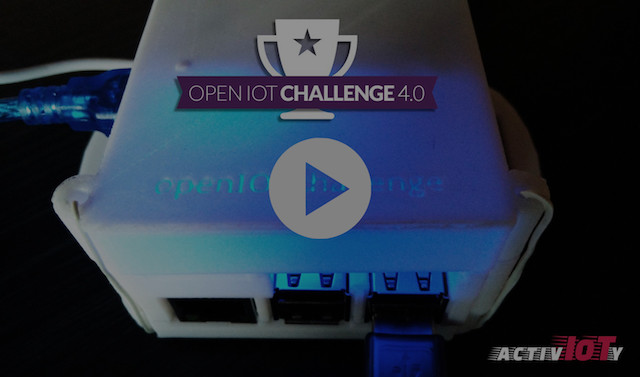
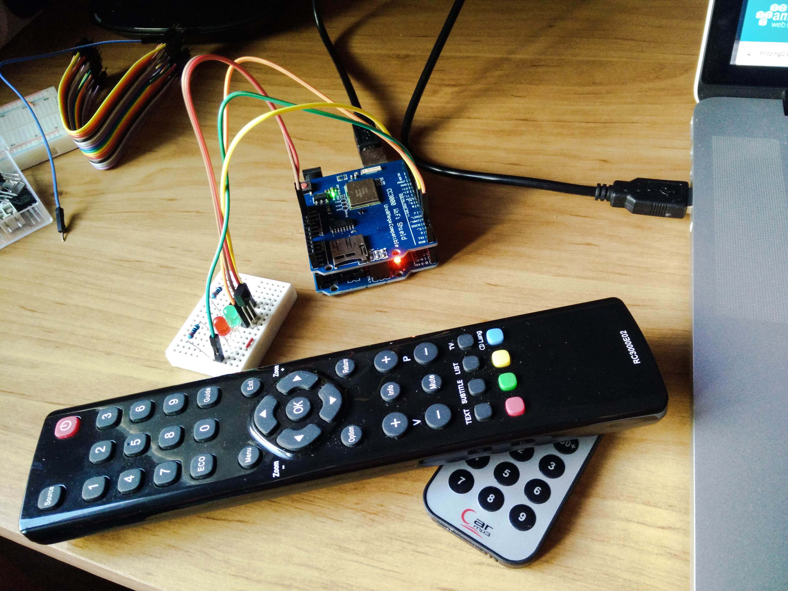
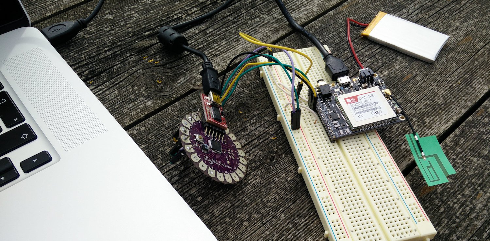
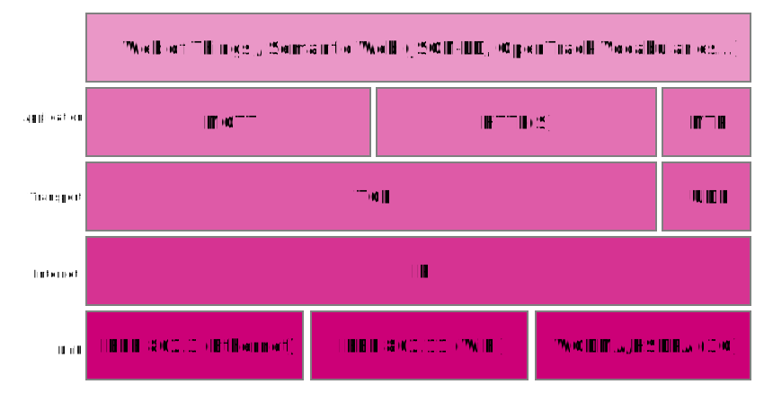
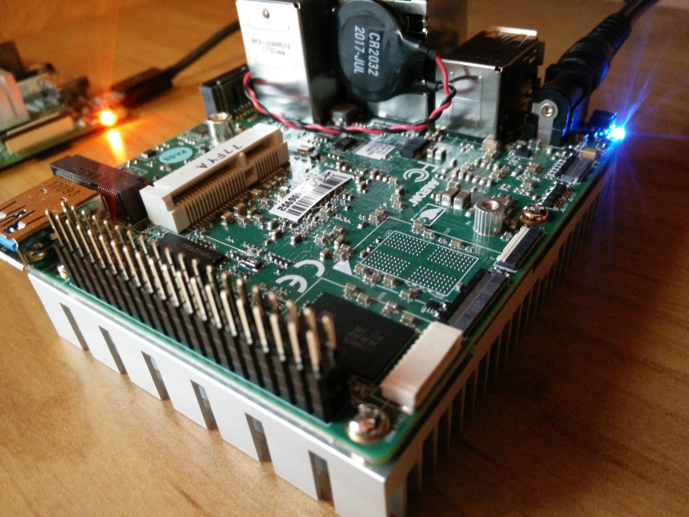
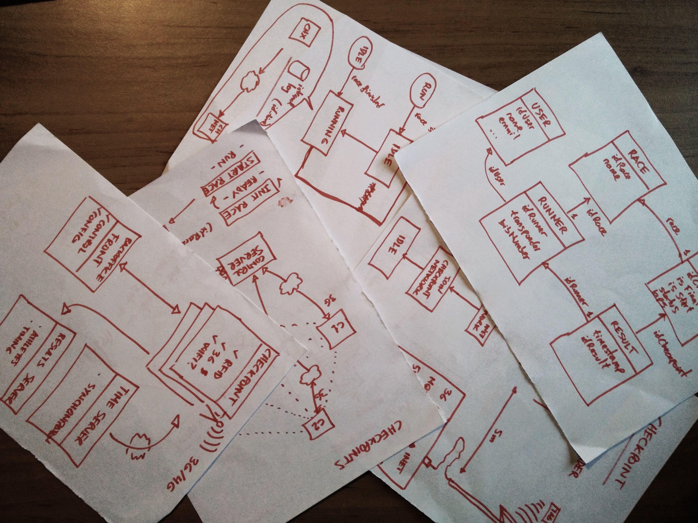
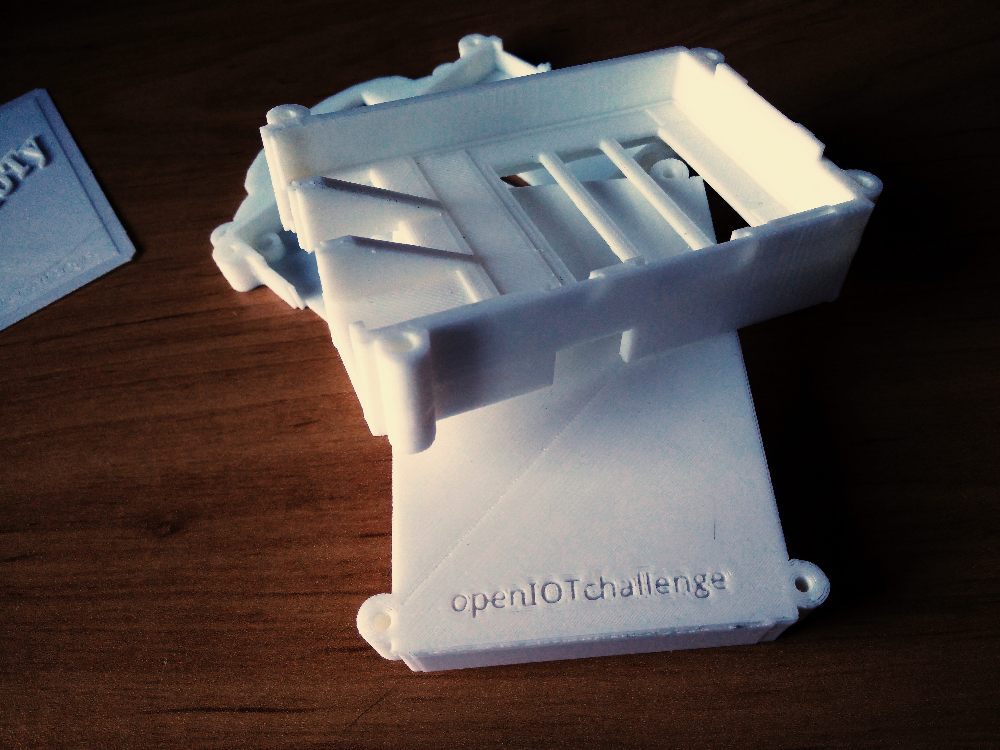

# Activ-IoTy Timekeeping Report

[](https://youtu.be/2j3yzmwb5g8)

Watch [the video](https://youtu.be/2j3yzmwb5g8) summarizing all the work done in this project in just 3 minutes.

## 1. Description of the project

Athletics is perhaps the most popular sport in the world. It’s not only the most followed discipline during the Olympic Games, but Jogging is also extended in all countries as a base sport for kids or adult people. Fun races are also becoming popular, even among those who don’t do sports regularly. This trend is affecting positively to health and good habits of people.

More than 30 thousand running events take place in the U.S. every year, including 5k, 10k and 8K/5 mile races as well as half-marathons and marathons ([source](https://www.statista.com/topics/1743/running-and-jogging/)). It [is estimated](https://www.statista.com/statistics/190303/running-participants-in-the-us-since-2006/) that there are over 47 million of runners (doing running/jogging or trail running) in the U.S.

In EU28, figures show that running is part of the way of life of many people. For instance, the 31% of the Danish population are runners, 25% in Germany ([source](https://www.palgrave.com/gp/book/9781137446367)). Most of these runners take part in competitions. 

To make competitive running attractive among athletes, there are two important aspects to take into account: **accurate/official timekeeping**, and **publication of comparable results** for statistics and competition. We can achieve this with the complex and reliable systems of the competition organizers but this implies high costs. Also, these timing systems are not available in some developing countries.

Just as an example, in the following image of the Kenyan Cross Country Championships this year. There you can see how the *fastest* athletes in the world are selected to run in the World Championships, for instance. It shows an ordered queue of athletes, just after crossing the finish line. Two officials take notes on cardboard tables. These lists of results are published but, they won't be interoperable at all.


Winners of the Kenyan Cross Country Championship 2018

Activ-IoTy Timekeeping is a system that the concepts of rapid prototyping and Internet of Things to develop a modular low-cost solution for timekeeping and competition management. This system is based on standard technologies that enable **plug and play different devices** and share information with external servers to process the results, records, etc.

The following diagram shows the main components of Activ-IoTy: **Checkpoints** and **Controller(s)**.

1. *Checkpoints* registers both competitor's ID and timestamp. These components are the MQTT *publishers*.
2. *Controller*(s) collects the information sent by the *Checkpoints* and processes the information. So, these are the MQTT *subscribers*.
3. Other third-party *subscribers* may perform other activities (i.e., visualizations, integration with third-party services, etc.)  


### 1.1. *Checkpoints* 

Those components perform the timekeeping activities. They are 'virtual gates' where competitors check-in to complete the full itinerary of the race. The objective of a *checkpoint* is to inform the system which competitor arrives at that specific location, *timestamping* that check-in. Checkpoints are multimodal and fully configurable. They can be designed and implemented with different IoT components to satisfy the requirements of the race and the organizers.

This pilot includes several *checkpoints* with different devices, platforms, and configurations. This serves to test a wide range of racing scenarios.


#### 1.1.1. Checkpoint 1: RFID Reader + Raspberry Pi + Python


This *Checkpoint* is based on a **IND903 UHF RFID Reader**, connected to a **Raspberry Pi** (or a **Intel Up Squared**). The reader controller, as well as the checkpoint are coded in Python. The MQTT Client is implemented using the **Paho** Python module.  

It is important to understand that each competitor taking part in a competition is identified by two unique IDs: 

1. the bib number: alphanumeric string that follows the organizers standards (it could be an alias, surname or bib number). In this case, an unsigned integer; and

2. an EPC (Electronic Product Code) corresponding to the RFID tag attached to their bib number. This tag follows the EPC C1G2 (Class 1 Generation 2) standard.

Check all the details and code in [Github page of this component](./checkpoints/rfid-reader-python).

The cost magnitude of this checkpoint depends on the antenna. The cost of the implementation of this pilot was around $150 (including RFID reader, sample tags, (5-6m reading range) antenna plus Rasberry Pi).

#### 1.1.2. Checkpoint 2: Bluetooth Keypad + Raspberry Pi + Python


This is a cheap option of checkpoint implementation. 

Athletics events are usually controlled by officials with different roles such as: judges, timekeepers and starters. Other competitions must rely on officials with other roles, even volunteers or marshals. This checkpoint enables officials and volunteers to register athletes at checkpoints using a simple physical keypad to type athlete's bib numbers. 

Since all athletes must wear a visible bib identifier, this implementation is compatible with the existing rules of official competitions. Keypad may be substituted by a complete keyboard. Of course, the keypad could be a capacitive screen (i.e., tablet, smartphone, etc.) but it is probed that data input operators are more efficient with physical typing devices. Also they may be robust, even waterproof. 

Check all the details and code in [Github page of this component](./checkpoints/bluetooth-keypad-python).

The cost of this checkpoint is below $50.

#### 1.1.3. Checkpoint 3: IR Remote + Arduino Uno



Having in mind a less optimistic scenario –low budget, few resources–, I've implemented another checkpoint using a different solution. This option would cost less than $50 and it's really easy to use. It can be developed with a components from a basic Arduino-like kit. 

A system based on Infrared (IR) remote control, is not very reliable for our purpose since there must be a direct visual line between transmitter and receiver –likely TV remote controls. **More than a real solution, this is a proof of concept**.

Check all the details and code in [Github page of this component](./checkpoints/ir-arduino).


#### 1.1.4. MQTT publication

*Checkpoints* send an MQTT message once an athlete arrives. It is of the `{checkpoint-ID}/checkpoint` topic:

```
{
    "checkpoint" : { 
        "id" : "…",             // Required
        "geo" : { "lat" : "…", "lng" : "…" }    // Optional
    },
    "bibId" : "…",              // Either 'bib' or 'epc' are required
    "epc"   : "…",
    "timestamp"  : 0000000,     // (NTP) UNIX time Required
}
```

For check-in messages, it is required the checkpoint identifier (some information may be added, such as coordinates in case the checkpoint is on the move), the unique identifier of the competitor (we can have several, such as bib number and RFID tag), and the timestamp of the check-in. 

Check more information about the [PubSub design in the project](./pubsub.md).


#### 1.1.5. Scalability and further options

Trying to expand the features and ecosystem of the platform, a mobile checkpoint was created with a Fona 3G module and an Arduino Lilypad.



Check [more information about this checkpoint on the move](./tracking).


### 1.2. Controller(s)

A *Controller* is basically a **responsive Web application** that enables competition management, including the processing of *check-ins* performed on checkpoints along the race course. There may be several controllers for different purposes, implementing different features. The controller of this pilot enables a complete management of the competition, from the registration and management of athletes, checkpoints, race, start list and visualizing the competition in real time.


[](http://www.youtube.com/watch?v=nTlSV7WbGoE)
Check the [full video of a real example (at high speed) on YouTube](http://www.youtube.com/watch?v=nTlSV7WbGoE).

Read more information [about the *Controller*](./controller) and its implementation. In case you **want to [test it](http://activioty.ddns.net)**, drop me an email and I'll send you the *admin* credentials. You could sign up the app, but with the role of *athlete*, so you won't be able to create and manage races (only *admin*s can do it).

Some other components such as the **MQTT Broker** are described in [a more detailed document about components](./components.md) of the project.

> The strongest point of Activ-Ioty Timekeeping is scalability thanks to its design based on device independence and open standards.

The strongest point of Activ-Ioty Timekeeping is device independence so any kind of devices may be used to implement *checkpoints*. Likely *checkpoints*, *controllers* may be designed to manage the information to cover any competition requirement (e.g., relay races, multi-lap courses, time-trial races, and others). 


## 1.3. Technology and Standards

The cornerstone of Activ-IoTy Timekeeping is the implementation based on open standards. Since the platform is designed to allow different and heterogeneous devices and implementations, standard technologies are crucial for scalability, enhancement of the system, and also to preserve the integrity of data. 

Design and implementation were focused on the use of standard technologies, open source libraries and mounted on open hardware devices. **Python v3** and **Embed C++** are the selected programming languages for the devices (*Checkpoints*); **JavaScript**, for the *Controller*.



Obviously, everything will run on the Internet. There are various underlying protocols since Activ-IoTy Timekeeping aims to be flexible in terms of physical connectivity. *Controllers* and *Checkpoints* may be installed in locations with strong WiFi signal (city or, town center), even with access to wired Ethernet routers, but also in the middle of the forest where we would need establish cellular GSM or 3G connections. Thus, the physical layer includes: [**IEEE 802.3 (Ethernet)**](http://www.ieee802.org/3/), [**IEEE 802.11 (WiFi)**](http://www.ieee802.org/11/) and [**WCDMA/HSDPA (3G)**](https://www.gsma.com/aboutus/gsm-technology/3gwcdma) protocols. 

In this sense, most of the tests were performed on WiFi access points, but the [Mobile Checkpoint](./tracking/) used a 3G cellular connection.

On top of the Internet, the transport layer is composed mainly by [**TCP** or Transmission Control Protocol](https://en.wikipedia.org/wiki/Transmission_Control_Protocol). [**UDP** or User Datagram Protocol](https://en.wikipedia.org/wiki/User_Datagram_Protocol) is used for specific applications such as time synchronization through external [NTP (Network Time Protocol)](http://www.ntp.org/ntpfaq/NTP-s-def.htm) servers.

### 1.3.1. MQTT, key in communications

*Checkpoints*, *controllers* and the rest of the modules are based on the Pub/Sub (Publication/Subscription) paradigm. Since the distributed system needs reliability and there is a potential lack of quality of communications, the solution uses [MQTT (Message Queuing Telemetry Transport)](http://mqtt.org/) as messaging protocol. MQTT allows *Checkpoints* (publishers) to send messages to the *Controllers* (subscribers). A *broker*, up and running in a reliable environment, will be in charge of delivering those messages effectively. 

**MQTT** implements different levels of Quality of service (QoS). **Integrity of data and rapidity is key for Activ-IoTy**. Also intermediate *Checkpoints* may be weak in terms of connectivity. Thus the system will implement **QoS 1 (at least once)**. Using QoS level 1, it is guaranteed that a message will be delivered at least once to the receiver. Messages can be delivered more than once but this will be taken into account and solved by the *Controller*.

The MQTT broker is implemented and running on a reliable UP-Squared accessible through the port 1883 of activioty.ddns.net. Regarding security, this broker does not provide a secure channel. This is a clear breach in the system but was done on purpose to offer real-time demonstrations in this prototype (i.e. jury of the challenge could subscribe to the MQTT queue in order to check the real messages running on the system, [like in the example](http://www.youtube.com/watch?v=nTlSV7WbGoE)). In case of real operation, the broker would implement either user authentication and SSL-secured transmissions.


*UpSquared Board used for prototyping and where servers are running* 

### 1.3.2. Web Standards

The system implements some examples of visualizations and operation on the system. The *Controller* manages a MongoDB where stores all the information produced by the system, including the MQTT messages about competitors' *check-ins* at *checkpoints*. Additional Web services may be exposed on top of that database, giving access to third parties to build additional services or products. Just as an example of this, the system may offer **[HTTP (Hypertext Transfer Protocol)](https://www.w3.org/Protocols/) RESTful services** to get race results. Value of data is clear, so this may increase the usefulness of the platform, enabling innovation in further developments (e.g., integration with social networks, better visualizations, etc.). 

The final design was complemented by other specific top level standards that guarantee **interoperability among similar systems around the world**. The description of underlying entities of the database using the [**OpenTrack vocabularies**](https://w3c.github.io/opentrack-cg/), an initiative to model the domain of Athletics in a standard way. Through this **[Schema.org](http://schema.org)** based vocabulary (and taxonomies), the system describes athletes, clubs, competitions and results in a semantic way. Check the [results generated after the test](./controller/sample_results.jsonld) in **JSON-LD** format.
  

## 2. Applicability to industry

As mentioned before, the running/jogging market is growing every year and competitions happen everywhere at any time. There are many applications and products that probe the importance of competitiveness in this sport. For instance, most of the sports tracking mobile apps (Strava, Nike+, Endomondo, etc.) include gamification based on performances and rankings. So, Activ-IoTy is part of this trend. 

It is important to say that **reliable timekeeping systems already exist**. Indeed, this is problem solved since years ago. We are used to seeing real-time results while we watch Athletics at the Olympic Games on TV. In this case, a few big companies provide timing services to Athletics Federations to cover these competitions. Those costs are not affordable for the majority of race organizers. Another problem is the lack of open standards in those solutions, so most of them are proprietary and closed.

> Activ-IoTy Timekeeping brings innovation, new business opportunities and social benefits

Because of this, Activ-IoTy takes advantage of this *running bubble*, enabling an open platform to enrich sports. As part of the *open* concept (i.e., open source, open hardware, open data, open standards), **Activ-IoTy enables SMEs to develop new business opportunities, offering timekeeping services, including new devices and mechanisms, enhancing the final products, fostering innovation**. 

As shown in the tests, this pilot is fully functional, but not very robust –only basic features covered, and lack of testing in depth. It could become a robust platform where build services on top of it (i.e., consultancy services, specific applications, new check-in methods, integration with third-party services, etc.). Apart from the platform, there is a clear value of the data produced. Information managed by Activ-IoT could be also part of the [open data](https://en.wikipedia.org/wiki/Open_data) ecosystem, so this brings innovation, new business opportunities, and benefits for the community.

As a next step, apart from evolving the hardware of the platform, the *controller* should implement APIs to communicate with the current commercial sports systems. Integration with other platforms is key to a quick success of the platform.  


## 3. Lessons learned



1. From software development to hardware prototyping. Back in December, I oriented the design phase as a software project –I have some experience in this field. When I started prototyping the checkpoints I found many issues that drove me crazy. I expected some parts to be easier, from the basic configuration of a device (e.g., installing the right BIOS, operating system, and drivers for the Intel UpSquared took me a few hours before it worked perfectly), to understanding why some implementations didn't work as expected (e.g., feeding the RFID reader with lower amperage than recommended). So, for this kind of projects, one **have to take into account more variables than a simple project of software development**.

2. *Community is key to the growth of IoT*. Developing new IoT solutions is a piece of cake. The Web is full of IoT enthusiasts aiming to help. I faced many issues during the implementation phase that were solved in minutes thanks to forums and blog posts on the Web. So, give attribution and share as well!! Eating my own dog food, code and documentation are available in the [Activ-IoTy Github Repository](https://github.com/espinr/activioty).  

3. Debugging is so hard… Most of the developments I've made for this project were based on existing libraries. Almost all worked properly at the first try, but not all. In case of low-level programming languages, such as some Arduino sketches, debugging was difficult in some parts. The lesson here is… be patient:-) 

4. **Python for arrays and bytes management**. Other software I used, such as the RDID-reader code, was created from scratch. Although I had no experience with it, I chose Python for its expected support of arrays and hexadecimal bytes required for the low-level communications protocol. It was a good experience. It's an intuitive programming language, with infinite modules to solve any challenge you face. The code may be run on some of the devices I had for the pilot (i.e., UpSquared and Raspberry Pi). 

5. **Beauty !== functional**. I bought an RFID Reader that has [worked right from the first try](https://www.youtube.com/edit?o=U&video_id=kmptDorc3zw). I used an 8dBi ceramic antenna which was enough to read tags properly in a 5-meter range. I decided to pack everything to make it portable and nice, so I designed and printed a case for a Raspberry Pi, the reader and the antenna. Making it from the scratch would be difficult, but I used an existing 3D model for a Raspberry Case on [TikerCad](https://www.tinkercad.com) to [create it](./checkpoints/rfid-reader-python/3D_model_RFID Reader + Antenna + RPi.stl).

Plastic shouldn't shield too much the readings so I designed the protective case with the antenna on top of the rest of the components.



I was proud of the *professional* result… Until I tested it :-) All devices worked properly, but RFID reading range decreased to a few inches. It was used to do some tests in the field (as seen in the video), but that time, the system missed around the 75% of the tags. 

I learned that both antenna and RFID tag positioning is crucial for this. Experts use the acronym SOAP to refer the four main aspects of tag positioning: Size, Orientation, Angle, and Placement. So, the recommendation is **test it (again and again)**, debugging the Receive Signal Strength Indication (RSSI) when a tag was read. 

6. **Mosquitto and Paho are cool**. I had never worked with queues. I chose MQTT and it was a really good idea. Those MQTT implementations are really stable, lightweight and easy to configure and use. 

7. **Haste makes waste**. Please, forgive me for the ugly name I chose for this project. It was a real improvisation. I sent [the proposal](https://www.youtube.com/edit?o=U&video_id=w4vCGbUDfnA) as soon as I heard of the Challenge, but this was the last day, after work (just finished the [Open Source for Industry 4.0 Webinar](https://www.meetup.com/Virtual-IoT/events/244900672/?_cookie-check=KQXWyGDLIXrJIslG)). So I improvised and submitted a vague idea I had in mind without caring too much. Now I regret it :-) 


**It was hard but I enjoyed a lot**. Nothing more to say :-) I think this was my first step in the IoT world. At least, I'll keep playing with Activ-IoTy Timekeeping. Yes, I know, In case I start some business around it, I'll change the name.  
   


