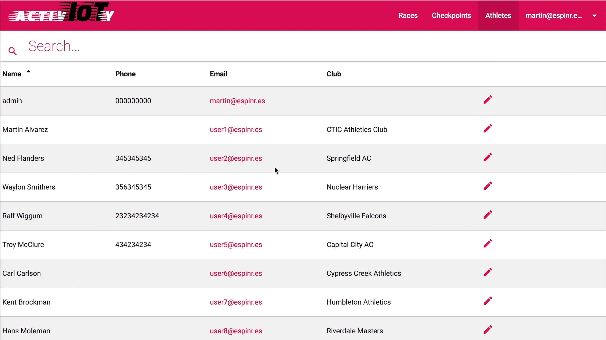
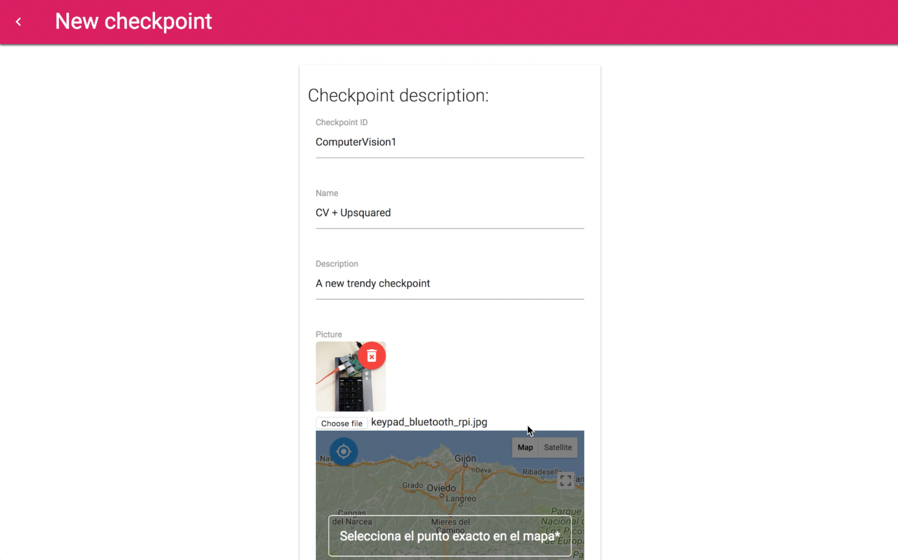
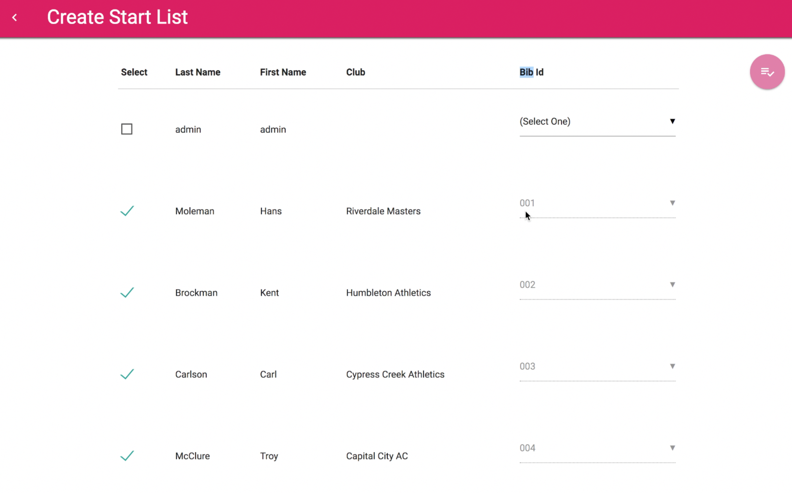
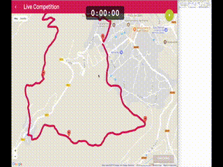
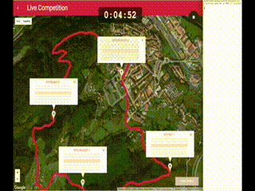
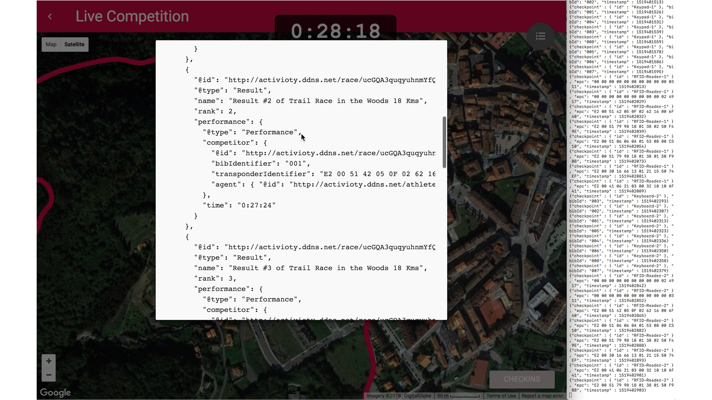

# The Controller

Activ-IoTy is composed of *[Checkpoints](../checkpoints/)* (devices that collects competitors' IDs, time-stamps it, and publish it), the MQTT Broker (an instance of Mosquitto Server) and the *Controller*. The *Controller* is the component that performs most of the platform's logic. 

> The Controller is a MQTT subscriber that processes the *checkins* performed on *Checkpoints*.

The Controller is basically a Web application that enables competition management, including the processing of *checkins* performed on checkpoints along the race course. There may be several controllers for different purposes, implementing different features. This controller allow us performing the following tasks: 

## Features

### Athletes Management 

Users that can sign-up into the platform and submit their profiles.



### Checkpoints Management

Creation/edition of *checkpoints*. This feature allows describing checkpoints that can be located on a map. Checkpoints are identified by their ID.



### Race Definition

Creation/edition of races. We can describe races, including a [geo-JSON](http://geojson.org/) file with the course and the **list of *Checkpoints* ** that athletes must visit to complete the race. Checkpoints might require more than a 'checkin' to complete the race (i.e., multi-lap races). This example is limited to just 1 lap. 

Obviously, only one *Checkpoint* can be at the finish line (it has to be selected using a radio button).


### Start List Creation

Registered athletes may be included as competitors in specific races. There is an automatic process where selected athletes are included as competitors in a race. Competitors have assigned unique bib identifiers. 

Bib identifiers must be linked to RFID tags. For this example, I use this map of unique identifiers (included in the collection `identifiers`):

```
[
  { bibId: '001', epc: 'E2 00 51 42 05 0F 02 62 16 00 6F 40' },
  { bibId: '002', epc: '00 00 00 00 00 00 00 00 00 00 03 11' },
  { bibId: '003', epc: '00 00 00 00 00 00 00 00 00 02 49 17' },
  { bibId: '004', epc: 'E2 00 51 79 98 18 01 38 02 50 F4 9E' },
  { bibId: '005', epc: 'E2 00 51 86 06 0A 01 53 08 00 C3 10' },
  { bibId: '006', epc: 'E2 00 51 79 98 18 01 38 01 50 F9 BB' },
  { bibId: '007', epc: 'E2 00 30 16 66 13 01 21 15 50 74 EF' },
  { bibId: '008', epc: 'E2 00 41 06 21 03 00 32 10 10 AF 41' },
]
```

For this prototype, I've populated the database, loading a JSON file directly. 


The following picture shows the start list of a race. All athletes shown are the users registered in the system. The administrator may assign bib numbers to athletes directly. 




### Real-time Competition

Once a race was defined, including the *checkpoints* assigned to the course, and the start list already created, the competition is almost ready to start. The *admin* is able to open the 'live results' option. In this screen, a map with the course track and the *checkpoints* are shown. 

At the beginning, the markers representing checkpoints are in red (disabled). Now, the controller is waiting for the `ready` MQTT messages from checkpoints. As soon as a checkpoint is ready, it sends a `{checkpoint-ID}/ready` message like this (is the first message the controller received during the example):

TOPIC: `Keyboard-2/ready`

MESSAGE:

```
{
  "checkpoint" : { "id" : "Keyboard-2" },
  "timestamp"  : 1519401196
}
```

*Checkpoints* are marked in white and their *infowindow* is shown. 

At the right-hand side of the image you can see a terminal connected to the same MQTT broker, waiting for the `+/ready` messages that are processed by the controller.



The competition starts (the *admin* presses the 'play' button'). Once the stopwatch is running the controller expects `+/checkin` messages from the checkpoints along the course. The following GIF shows the moment when competitors arrived at the first checkpoint (ID: `Keypad-1`).   

The first checkpoint is powered by a keypad so the device sends the bib number of the athlete in a message like the following example (it is the same the checkpoint sent when the first athlete did the *checkin*). In the right-hand side of the video, you can see a terminal with a Mosquitto client waiting for the same `+/checkin` messages as the controller does).

TOPIC: `Keyboard-2/checkin`

MESSAGE:

```
{
  "checkpoint" : { "id" : "Keyboard-2" },
  "bibID" : "002",
  "timestamp"  : 1519401513
}
```



The competition may be followed in real time as shown in the full video –the video was speeded up to show just the relevant events: readiness of checkpoints and *checkins* at all checkpoints. On the right hand side, there are two terminals running Mosquitto subscribers to see the real messages processed by the controller. 

#### Complete video:

[](http://www.youtube.com/watch?v=nTlSV7WbGoE)
Check the full video at http://www.youtube.com/watch?v=nTlSV7WbGoE
  

### Results in Open Format

Final results may be exported once the *admin* considers that the race is finished (other intermediate results could be exported).

This data is served in JSON-LD, following the [OpenTrack model](https://w3c.github.io/opentrack-cg/spec/model/). This vocabulary is based on [schema.org](http://schema.org) and is in process of standardisation. 



## Implementation

The *Controller* is developed in [Meteor](https://www.meteor.com), an open source platform for Web, mobile, and desktop applications build in JavaScript. The resulting mobile web application is compatible with all the latest browsers and it has been designed using the responsive web design approach, in concrete through the [Materialize CSS](http://materializecss.com/) framework.

In terms of technology, the application is built in JavaScript and is run on a [Node.js](https://nodejs.org/en/) server, and a [MongoDB](https://www.mongodb.com/) as the subjacent database system.

The application **is fully operational** and you can test it, but it is in an early development phase so it implements exactly the requirements of the pilot.

### MQTT for in Javascript

The system uses [MQTT.js](https://www.npmjs.com/package/mqtt), a client library for the MQTT protocol. It is written in JavaScript for node.js and any browser. It can be installed through NPM with just the following command:

```
npm install mqtt --save
```

Since the application must be subscribed to the MQTT queue, mqtt.js is configured in the server side of Meteor to wait for new messages from checkpoints. During the startup of the *Controller*, the a new subscription is setup (to topics `+/ready` and `+/checkin`. Also the callbacks of these events are configured.

Once a new *checkin* is detected, the *Controller* creates a new document on the `checkins` collection in the database with all the information of the received *checkin*. Also, when it detects that a checkpoint is ready, a `ready` flag in the database is updated to `true`. The concrete code is this:

```
/*
 * File at /imports/startup/server/mqtt.js
 */

import { Meteor } from 'meteor/meteor';
import mqtt from 'mqtt';
import Sntp from 'sntp';
import { Checkpoints } from '../../api/checkpoints/checkpoints.js';
import { Identifiers } from '../../api/identifiers/identifiers.js';
import { Checkins } from '../../api/checkins/checkins.js';

if (Meteor.isServer) {
  const mqttBroker = {
    url : 'mqtt://activioty.ddns.net',
    port: 1883,
  };

  const mqttClient = mqtt.connect(mqttBroker.url, mqttBroker.port);

  mqttClient.on('connect', () => {
  	const timestamp = Sntp.now();
    mqttClient.subscribe({ '+/ready': 1, '+/checkin': 1 });
    mqttClient.publish('controller/ready', `{ "checkpoint" : { "id" : "I am the controller :-)"}, "timestamp" : ${timestamp} }`);
  });

  mqttClient.on('message', Meteor.bindEnvironment((topic, message) => {
    const timestamp = Sntp.now();
    console.log(`MQTT Message received [${topic.toString()}] -> ${message.toString()}`);
    if (topic.includes('/ready')) {
      // Marks the checkpoint as ready
      try {
        const msg = JSON.parse(message.toString());
        Checkpoints.update({ identifier: msg.checkpoint.id }, { $set : { ready : true } }, (error, result) => {
          if (error) { console.log(error); }
          if (result) {
            console.log(`${result} Checkpoint ${msg.checkpoint.id} is marked as ready (${msg.timestamp})`);
          }
        });
      } catch (e) {
        console.log('I cannot process the readiness of a checkpoint, so I skip it');
      }
    } else if (topic.includes('/checkin')) {
      // Includes the athlete in the checkins database
      try {
        const msg = JSON.parse(message.toString());
        const checkpoint = Checkpoints.findOne({ identifier: msg.checkpoint.id });
        let identifier;
        if (msg.epc) {
          identifier = Identifiers.findOne({ epc: msg.epc });
        } else {
          identifier = Identifiers.findOne({ bibId: msg.bibId });
        }
        const docToInsert = {
          checkpointId: checkpoint._id,
          bibIdentifier: identifier.bibId,
          epc: identifier.epc,
          timestamp: msg.timestamp,
        };
        Checkins.insert(docToInsert, (error, result) => {
          if (error) { console.log(error); }
          if (result) {
            console.log(`Checkin of Bib Number ${identifier.bibId} at ${checkpoint.name}`);
          }
        });
      } catch (e) {
        console.log('I cannot process the checkin in a checkpoint, so I skip it');
      }
    }
  }));
}
```

The controller will process and work directly with the `checkins` collection in the database. 

#### mqtt-collection package for Meteor

Another alternative, that was tested but not used in the final solution is [mqtt-collection](https://github.com/perak/meteor-mqtt-collection), a MQTT package for Meteor that collects and stores the MQTT messages received. Messages are stored in the MongoDB directly, enabling reactive support for the client side.

This package is easy to use. The following code includes the definition of the MQTT `messages` collection and establishes the connection with the MQTT broker, indicating the topics. 

```
/*
 * File at /imports/api/messages/messages.js
 */
import { Meteor } from 'meteor/meteor';
import { Mongo } from 'meteor/mongo';

export const Messages = new Mongo.Collection('messages');

if (Meteor.isServer) {
  Messages.mqttConnect('mqtt://activioty.ddns.net:1883', ['+/ready', '+/checkin'], { insert: true }, {});
}
```

### Timing 

In order to adjust time to the common NTP servers, the system uses the [**sntp package**](https://www.npmjs.com/package/sntp). This is a SNTP v4 client (RFC4330) for Node.js. It allows the server connecting to the NTP server and returns the server time along with the roundtrip duration and clock offset. To adjust the local time to the NTP time we would need to add the returned offset to the local time. 

The main stopwatch of the application is built with [aldeed:clock](https://github.com/aldeed/meteor-reactive-clock), An accurate reactive clock package for Meteor that retains elapsed time. Usage is simple and reliable. 

This is a summary of the main declarations related to the official stopwatch of the competition:


```
/* 
 * file at: /imports/ui/components/competition/competition.js
 */ 

Template.competitionMain.onCreated(() => {
  // ...
  template.CompetitionClock = new ReactiveClock('ExerciseClock');
  template.CompetitionClock.setElapsedSeconds(0);    
  // ... 
}

Template.competitionMain.helpers({
  stopwatch() {
    const template = Template.instance();
    return template.CompetitionClock.elapsedTime({ format: '00:00:00' });
  },
  // ...
});

Template.competitionMain.events({
  'click #startCompetition-button'(event) {
    const template = Template.instance();
    template.CompetitionClock.start();
    template.startTimestamp.set(Sntp.now() / 1000);
    // ...
  },
  'click #finishCompetition-button'(event) {
    const template = Template.instance();
    template.CompetitionClock.stop();
    template.finishTimestamp = Sntp.now();
    // ...
  },
});
```

### Athlete's Checkins

If the clock is enabled (ongoing competition), the controller system waits for `checkin` messages. The application runs this code, once a new checkin is included in the database:  

```
  Tracker.autorun(() => {
  	// Gets the current Race
    template.currentRace = Races.findOne({ _id: raceId });
    if (template.currentRace && template.currentRace.checkpoints) {
      template.currentRace.checkpoints.forEach((checkpoint) => {
      	// creates a local array with checkpoints
        template.checkpoints.push(Checkpoints.findOne({ _id: checkpoint.id }));
      });
    }
    // If the clock is running 
    if (template.startTimestamp.get() && template.startTimestamp.get() > 0) {
      template.subscribe('checkins.after', template.startTimestamp.get());
      template.checkpoints.forEach((checkpoint) => {
        const checkinsForCheckpoint = Checkins.find({ checkpointId: checkpoint._id });
        if (checkinsForCheckpoint) {
          checkinsForCheckpoint.forEach((checkin) => {
            let competitor;
            if (checkin.epc) {
              competitor = Competitors.findOne({ epc: checkin.epc });
            } else {
              competitor = Competitors.findOne({ bibId: checkin.bibId });
            }
            const totalTime = checkin.timestamp - template.startTimestamp.get();
            // The rest of the logic in the application (show it on a map, store results, etc.)
            checkinAthlete(template, checkpoint, competitor, totalTime);
          });
        }
      });
    }
  });
```

This pilot illustrates how to the data can be processed and visualized. Other services and products on top of it are unlimited.

## Deployment and testing


*Activ-IoTy Controller* is deployed on a UPsquared I have at home. I'll post the URL for you to test it.


